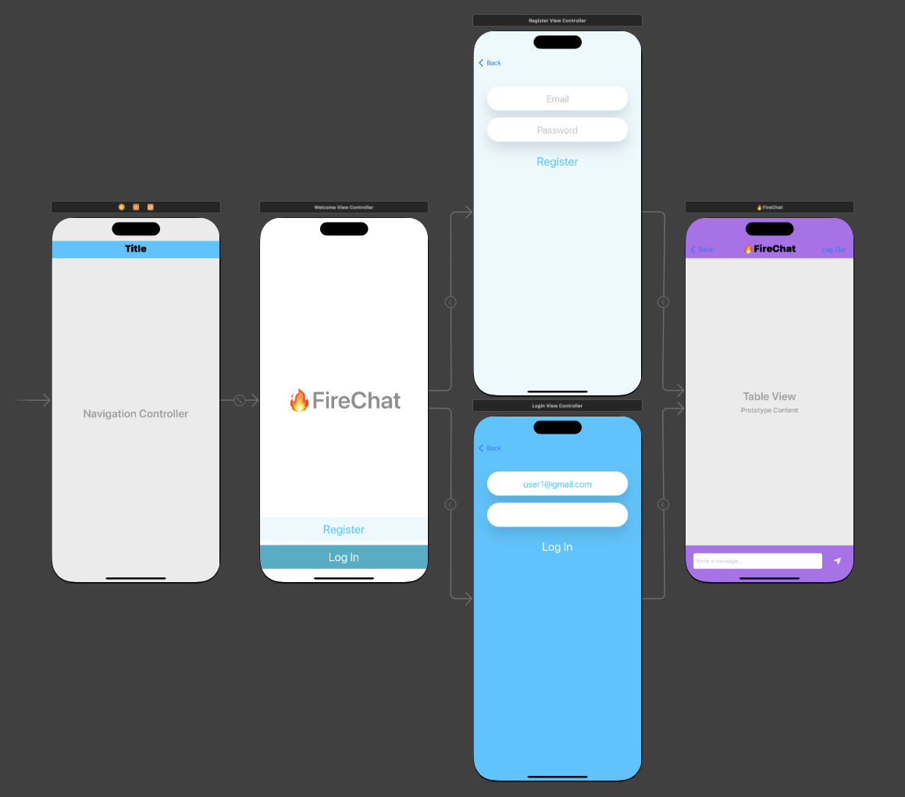
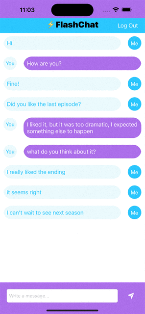

IOS WeatherClone 
==========================
This is a chat application based on Firebase which integrates elements from CocoaPods

## Screenshots



## Features
* Firebase Firestore as a Cloud Database
* Firebase Authentication
* Cocoapods
* Swift Package Manager
* Custom UI with .xib files 
* MVC
* IOS Table Views
* IOS Navigation Controller
* UIKit 

## CocoaPods
* CLTypingLabel
* IQKeyboardManagerSwift 



## How to build

1) Clone the repository

```bash
https://github.com/GorganMihai/FireChat.git
```

2) Add all pods in description

3) Add Firebase packages


# Requirements 

* Xcode 13
* iOS 15.5
* Swift 5

