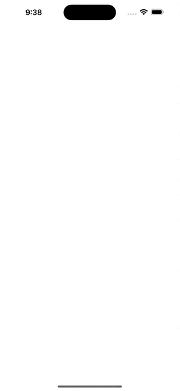

IOS WeatherClone 
==========================
This is an apple-like weather application that allows the users to see the weather in real time, at their location or elsewhere via search. This application integrates several elements that I have specified below

## Screenshots
 


## Features
* Ucccaaaaazzzzzzzz
* Core Location
* Work with APIs - HTTP request with URLSession
* Parse JSON with the native JSONDecoder
* Swift Protocol - Delegate Design Pattern  
* MVC - Model View Controller
* Dark-Mode
* Custom UIView
* UIStackView 

## How to build

1) Clone the repository

```bash
https://github.com/GorganMihai/FireChat.git
```

2) Add your OpenWeather API key


# Requirements 

* Xcode 13
* iOS 15.5
* Swift 5

